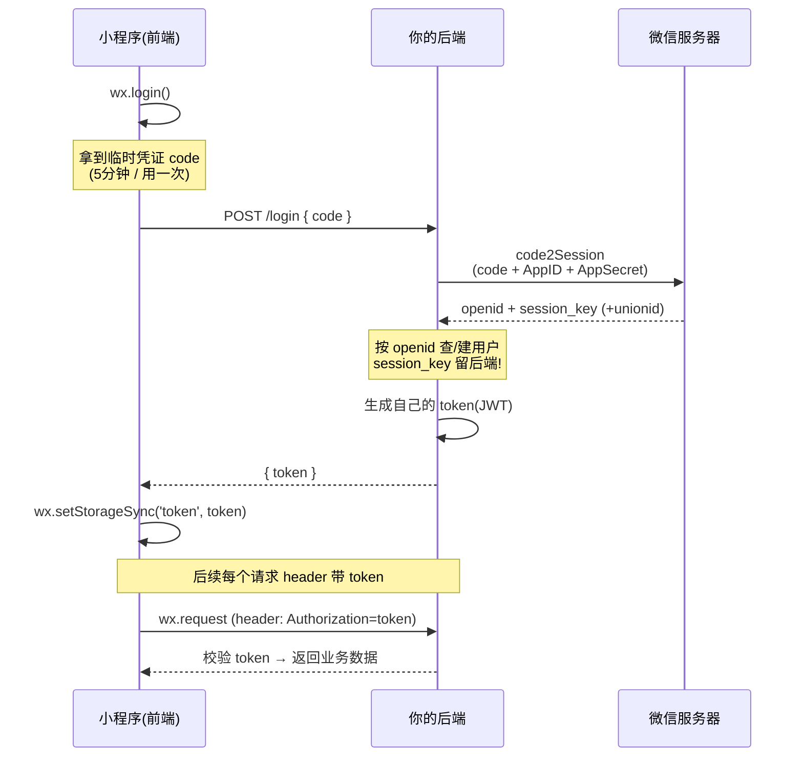

# 11 · 登录与授权（Login & Auth）

> 小程序没有"账号密码注册"，靠 `wx.login()` 拿一次性 **code**，让**你的后端**去微信服务器换用户身份（**openid**）+ 发自己的 **token**——这是小程序接后端的第一道工序。重要度 ⭐⭐⭐。官方：developers.weixin.qq.com

## 🎯 一句话核心

小程序登录的本质是**换身份**：`wx.login()` 只给你一张**临时凭证 code**（5 分钟有效、用一次作废），前端**换不出**用户身份；必须把 code 传给**你的后端**，后端拿 **code + AppID + AppSecret** 偷偷调微信的 `code2Session` 接口，换回**唯一标识 openid** 和 **会话密钥 session_key**，再由后端签发**自己的 token** 给小程序保存。之后每次请求带上 token 即可（就是 Web 的登录态，只是"用户名密码"换成了"微信 code"）。

## 📖 核心概念 / 讲解

**★ 微信登录流程（最核心，务必理解这条链）。** 和 Web 最大的不同：用户不输账号密码，微信天然知道"你是谁"。整条链路的关键是**谁能碰 AppSecret**——它是小程序的"总钥匙"，**只能存在后端**，绝不能进前端代码。因此换身份这一步**必须由后端做**：

1. **小程序：`wx.login()`** → 微信客户端返回一个**临时凭证 code**（`res.code`）。code 只是"提货单"，本身不含用户信息，**5 分钟过期、只能换一次**。
2. **小程序 → 你的后端**：用 `wx.request` 把 code 发给自己的登录接口（如 `POST /login`，见 [09-network-storage](../09-network-storage/)）。
3. **后端 → 微信服务器**：后端用 `code + AppID + AppSecret` 调微信接口 **`code2Session`**（`https://api.weixin.qq.com/sns/jscode2session`）。
4. **微信服务器 → 你的后端**：返回 **openid**（该用户在此小程序内的唯一标识）+ **session_key**（会话密钥，用于解密敏感数据）+（可能有）unionid。
5. **后端**：拿 openid 去自己数据库查/建用户，生成**自己的登录态 token**（JWT 或 session id），**把 session_key 留在后端**（切勿下发），只把 token 返回小程序。
6. **小程序**：把 token 存进 `wx.setStorageSync('token', ...)`（[09-network-storage](../09-network-storage/)）。
7. **后续请求**：每次 `wx.request` 在 header 带上 token（如 `Authorization`），后端校验 token 认出用户。

**为什么非要绕后端？** 因为换身份需要 **AppSecret**，而 AppSecret 一旦泄露别人就能冒充你的小程序换取任意用户身份。前端代码是公开可反编译的，所以微信的设计强制：**前端只拿 code，换身份必须在后端**。

**openid vs unionid（区分用户身份）。**

| 标识 | 唯一范围 | 什么时候用 |
|---|---|---|
| **openid** | **单个**小程序内，一个用户唯一 | 小程序内识别用户的主键；同一个人在你另一个小程序里 openid 不同 |
| **unionid** | **同一微信开放平台账号**下的**多个**应用（小程序+公众号+App）间唯一 | 想打通"同一个人在你家公众号和小程序是同一账号"，认 unionid |

> 记法：openid 是"某个小程序里的你"，unionid 是"整个企业矩阵里的你"。需要 unionid 必须先把小程序绑定到**微信开放平台**账号下。

**★ 获取用户信息（头像昵称）。** 登录只拿到 openid（匿名 id），拿不到头像昵称。要头像昵称得**用户主动授权**：

- **`wx.getUserProfile`**：**必须由用户点击**（如点按钮）触发，**不能静默/页面一进来就调**，否则报错。每次调用都会弹授权框。返回 `userInfo`（昵称、头像 url、性别等，不含 openid）。
- **新版"头像昵称填写"能力**：微信收紧了 `getUserProfile`，现在推荐用 `<button open-type="chooseAvatar">`（选头像）+ `<input type="nickname">`（填昵称）让用户**自己填**，体验更合规。
- 关键认知：**头像昵称是展示用的，不能当身份**——真正的身份是后端根据 openid 认定的。

**★ 手机号授权（要真实手机号）。** 昵称能瞎填，手机号是强身份，很多业务要它。流程：

1. 用 **`<button open-type="getPhoneNumber" bindgetphonenumber="onPhone">`**（必须 button，用户点击触发）。
2. 用户同意后，回调 `onPhone(e)` 拿到**加密数据**（新版是 `e.detail.code`，旧版是 `encryptedData + iv`）——**前端拿到的是密文，解不开**。
3. 把这个 code/密文发给**后端**，后端用 **session_key**（新版用专门的 `phonenumber.getPhoneNumber` 接口 + access_token）**解密**出真实手机号。
4. 前端永远看不到明文手机号，安全。

> 注意：`getPhoneNumber` 通常需要小程序**已认证**（企业主体）才能用。

**授权状态查询与引导设置。** 用户可能拒绝授权，或之前拒了想重新开：

- **`wx.getSetting()`**：查用户已授权了哪些权限（`res.authSetting`，如 `scope.userLocation`）。
- **`wx.openSetting()`**：打开小程序的**授权设置页**，引导用户手动打开被拒的权限（不能直接弹授权，只能引导去设置页）。
- 注意：**登录 `wx.login` 不需要授权**（拿 code 是静默的）；需要授权的是"用户信息、位置、手机号"等敏感 scope。

**安全红线（面试高频）。**

- **AppSecret 只在后端**，绝不写进小程序代码。
- **session_key 绝不下发前端**——它是解密敏感数据的钥匙，留在后端。
- **敏感数据（手机号等）在后端解密**，前端只当"搬运密文"的管道。
- **身份以后端为准**：前端传来的 openid/手机号都不可信，一切以后端用 code 换、用 session_key 解出来的为准。

**对比 Web（有 Web 基础对照记）。**

| 维度 | Web 登录 | 小程序登录 |
|---|---|---|
| 用户凭证 | 账号 + 密码 / 第三方 OAuth | **`wx.login()` 拿 code**（无密码） |
| 换身份 | 后端校验密码 | 后端拿 **code+AppSecret** 调 `code2Session` 换 openid |
| 用户唯一 id | 自己数据库的 user_id | **openid**（微信给的） |
| 登录态 | Cookie/Session/JWT **token** | **一样**——后端签发 token，前端存 storage 带 header |
| 拿手机号 | 用户输入 + 短信验证码 | **授权按钮**拿密文，后端解密 |

> 一句话：**换身份的方式变了（微信 code 代替账号密码），但 token 登录态机制和 Web 一模一样**。

## 💻 代码示例：完整登录 + 手机号授权

**★ 登录时序图（Mermaid）。**



**① 小程序端：登录换 token。**

```js
// pages/login/login.js
Page({
  doLogin() {
    // 第一步：拿临时凭证 code（静默，无需授权）
    wx.login({
      success: (res) => {
        if (!res.code) return console.error('login 失败', res);
        // 第二步：把 code 发给自己的后端换 token
        wx.request({
          url: 'https://api.你的域名.com/login',
          method: 'POST',
          data: { code: res.code },   // ← 只传 code，不传别的
          success: (r) => {
            const token = r.data.token;      // 后端签发的登录态
            wx.setStorageSync('token', token); // 存本地(见 09-network-storage)
            wx.showToast({ title: '登录成功' });
          }
        });
      }
    });
  }
});
```

**② 后端（Node.js 伪代码）：用 code 换 openid 再发 token。**

```js
// 服务端 /login 接口（AppSecret 只存在这里！）
app.post('/login', async (req, res) => {
  const { code } = req.body;
  // 调微信 code2Session 换身份
  const wxRes = await fetch('https://api.weixin.qq.com/sns/jscode2session?' +
    `appid=${APP_ID}&secret=${APP_SECRET}` +   // ← AppSecret 绝不进前端
    `&js_code=${code}&grant_type=authorization_code`
  ).then(r => r.json());

  const { openid, session_key, unionid } = wxRes; // session_key 留后端，别下发!
  const user = await db.findOrCreateByOpenid(openid);
  saveSessionKey(openid, session_key);            // 存后端(缓存/DB)，供后续解密

  const token = jwt.sign({ userId: user.id }, JWT_SECRET, { expiresIn: '7d' });
  res.json({ token });                            // ← 只把自己的 token 给前端
});
```

**③ 后续请求带 token。**

```js
// 封装请求时统一带上（见 09-network-storage 的封装思路）
wx.request({
  url: 'https://api.你的域名.com/orders',
  header: { Authorization: 'Bearer ' + wx.getStorageSync('token') },
  success: (res) => { /* 后端校验 token 认出用户 */ }
});
```

**④ 手机号授权：button + 后端解密。**

```html
<!-- login.wxml：必须用 button + open-type，用户点击才触发 -->
<button open-type="getPhoneNumber" bindgetphonenumber="onGetPhone">
  微信手机号一键登录
</button>
```

```js
// login.js
Page({
  onGetPhone(e) {
    // 用户拒绝：e.detail.errMsg 含 'deny'
    if (e.detail.errMsg.indexOf('ok') === -1) return;
    // 新版拿到的是 code（不是明文手机号！），交给后端解密
    wx.request({
      url: 'https://api.你的域名.com/bind-phone',
      method: 'POST',
      header: { Authorization: 'Bearer ' + wx.getStorageSync('token') },
      data: { code: e.detail.code },   // ← 密文/凭证，前端解不开
      success: () => wx.showToast({ title: '绑定成功' })
    });
    // 后端用 session_key / access_token 调微信接口解密出真实手机号
  }
});
```

**⑤ 查授权 + 引导设置。**

```js
wx.getSetting({
  success: (res) => {
    if (!res.authSetting['scope.userLocation']) {
      // 之前被拒，引导用户去设置页手动开
      wx.openSetting({ success: (r) => console.log(r.authSetting) });
    }
  }
});
```

## 🔑 要点速记

- **★ 登录链**：`wx.login()` 拿 **code** → 传后端 → 后端 `code+AppID+AppSecret` 调 **`code2Session`** 换 **openid+session_key** → 后端发 **token** → 前端存 token → 请求带 token。
- **code** 是临时凭证：**5 分钟过期、只能换一次**、本身不含用户信息。
- **openid**：单个小程序内唯一；**unionid**：同一开放平台账号下多应用唯一（需绑开放平台）。
- **换身份必须在后端**——因为要用 **AppSecret**，前端代码公开不能放。
- **`wx.getUserProfile`** 拿头像昵称：**必须用户点击触发、不能静默**；新版推荐 `open-type="chooseAvatar"` + `type="nickname"` 让用户自己填。
- **手机号**：`button open-type="getPhoneNumber"` + `bindgetphonenumber` 拿**密文/code** → **后端用 session_key 解密**得手机号。
- **`wx.getSetting`** 查授权、**`wx.openSetting`** 引导用户去设置页（不能强弹授权）。
- **安全三条**：AppSecret 只后端、session_key 不下发前端、敏感数据后端解密。
- 对比 Web：**没有账号密码**，靠微信 code 换身份，但 **token 登录态机制和 Web 一样**。

## ⚠️ 易错点 / 最佳实践

- ⚠️ **别想在前端直接拿 openid**——`wx.login` 只给 code，openid 只有后端调 `code2Session` 才拿得到；网上"前端解 code"的做法是错的/危险的。
- ⚠️ **code 用一次就废**：不要缓存 code 复用，也别一次 login 发多个请求；每次登录重新 `wx.login`。
- ⚠️ **`wx.getUserProfile` 不能静默调**——必须挂在用户点击事件里，页面 `onLoad` 里直接调会失败。旧的 `wx.getUserInfo` 静默拿信息的能力已被回收。
- ⚠️ **AppSecret / session_key 绝不进前端**——写进小程序代码或下发给前端 = 安全事故；session_key 还会随用户再次 `wx.login` 而变化。
- ⚠️ **手机号前端拿到的是密文不是明文**——必须发后端解密，别指望前端能读出手机号。
- ⚠️ **登录态会过期**：token 过期或 `wx.checkSession()` 发现 session 失效时，要重新走 `wx.login` 换新 token。
- ✅ **登录时机**：`wx.login` 无需授权可尽早做（甚至 `onLaunch`）换好 token；把"授权用户信息/手机号"延后到用户真正需要时再弹，体验更好。
- ✅ 拒绝授权要有兜底：用 `wx.getSetting` 判断，用 `wx.openSetting` 引导，别让流程卡死。
- 🔗 上一步：网络与存储（存 token、带 header）→ [09-network-storage](../09-network-storage/)；常用 API → [10-apis](../10-apis/)；官方文档 → <https://developers.weixin.qq.com/miniprogram/dev/framework/open-ability/login.html>。
