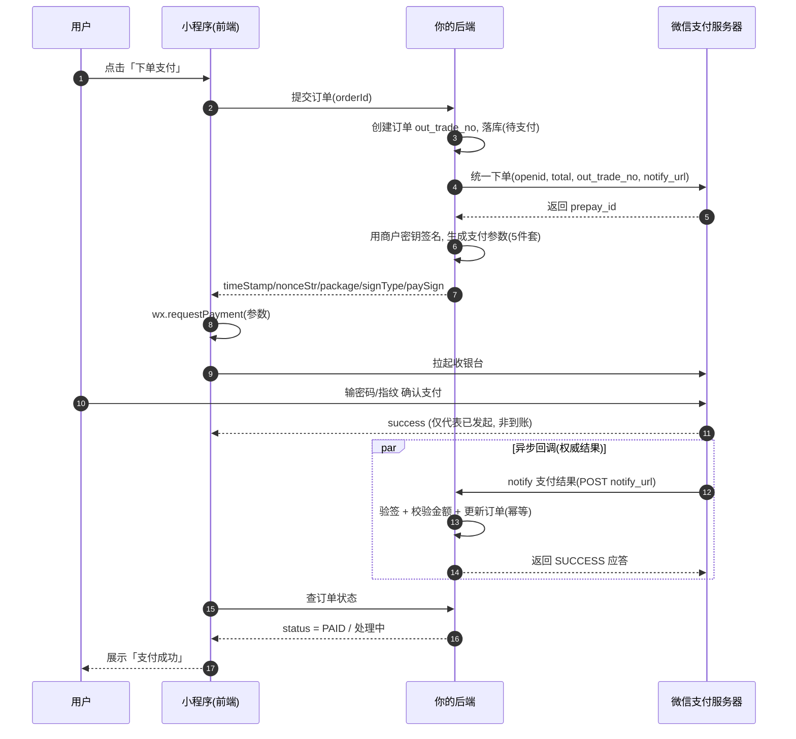

# 12 · 微信支付（WeChat Pay）

> 小程序里发起支付：**前端只负责"拉起收银台"，真正的下单、签名、验签、订单状态全在后端**。核心记住一句——**钱以后端异步通知为准，前端 `wx.requestPayment` 的 success 只代表"用户点了支付"，不代表"钱到账了"**。重要度 ⭐⭐。官方：developers.weixin.qq.com

## 🎯 一句话核心

小程序支付是一场**四方接力**：小程序（前端）→ 你的后端 → 微信支付服务器 → 用户。前端唯一的动作是拿着后端算好的**支付参数**调 `wx.requestPayment(...)` 拉起微信收银台；**商户密钥、统一下单、签名、回调验签全部锁在后端**。前端拿到 success 只是"发起成功"，最终订单是否真的支付成功，**必须以微信异步回调后端的 notify 通知为准**。

## 📖 核心概念 / 讲解

**为什么支付要拆成前后端两半？** 和普通网页调第三方支付（支付宝/Stripe）是同一套模型：**任何涉及金额与密钥的计算都不能放前端**。前端代码用户可见、可改，一旦把商户密钥（API Key）放进小程序，别人就能伪造订单、篡改金额。所以微信支付的分工是固定的——**前端拉起，后端下单 + 签名 + 验签 + 处理回调**。这条和第 [11-login-auth](11-login-auth.md) 里"敏感逻辑放后端"的原则完全一致。

**★ 支付完整流程（重点，务必理解这条时序）。** 一次 JSAPI/小程序支付要走完下面这条链，任何一步都省不掉：

1. **用户下单** → 小程序把商品/订单信息发给**你的后端**（不是微信）。
2. **后端创建订单** → 生成唯一**商户订单号 `out_trade_no`**，落库，状态置为"待支付"。
3. **后端调微信「统一下单」API**（`unifiedorder` / v3 `/pay/transactions/jsapi`）→ 传 **openid（谁付）、金额 total（分）、out_trade_no（哪笔）、notify_url（回调地址）** 等。
4. **微信返回 `prepay_id`**（预支付交易会话标识，代表"这笔单微信记下了"）。
5. **后端按微信规则签名** → 用 `prepay_id` 拼出**前端支付参数**：`timeStamp` / `nonceStr` / `package`（`prepay_id=xxx`）/ `signType`（`RSA` 或 `MD5`）/ `paySign`。**签名用商户密钥在后端算**。
6. **后端把这 5 个参数返回小程序**。
7. **小程序调 `wx.requestPayment(参数)`** → 拉起微信原生收银台。
8. **用户输密码/指纹支付** → 微信处理扣款。
9. **微信「异步回调」后端**（POST 到你的 `notify_url`）→ 通知支付结果。**这是钱到账的唯一权威信号**。
10. **后端验签 + 校验金额 + 更新订单**为"已支付"（幂等处理），返回微信 `SUCCESS` 应答（否则微信会重试通知）。
11. **小程序查订单状态** → 用户支付返回后，前端调后端"查订单"接口，按后端库里的真实状态展示"支付成功/处理中"。

**关键点（背下来）：**
- **签名 + 商户密钥永远在后端**，绝不能出现在小程序代码或请求里。
- **支付结果以后端异步通知（notify）为准**，不能只信前端 `wx.requestPayment` 的 `success`——它只代表"收银台流程走完/用户点了确认"，可能出现前端 success 但回调还没到、或用户支付后网络中断的情况。
- **订单号 `out_trade_no` 幂等**：同一笔业务订单反复下单要能识别、防重复扣款；回调也要幂等（微信会重复通知，处理过就直接返回 SUCCESS）。

**必要条件（缺一不可）：**
- **已认证的小程序**（个人小程序不支持微信支付）。
- **微信支付商户号（mch_id）** + 对应的**商户 API 密钥/证书**。
- 商户号与小程序 AppID **完成关联/绑定**（在商户平台或微信支付后台配置）。

**退款。** 同样走后端：后端调**退款 API**（v3 `/refund/domestic/refunds`），传原 `out_trade_no`/`transaction_id`、退款单号、退款金额。**前端没有任何退款 API**，只能调你后端的退款接口，退款结果也由微信异步回调后端。

**和其它第三方支付对比（有后端经验对照记）：**

| 维度 | 支付宝 / Stripe 等 | 微信小程序支付 |
|---|---|---|
| 前端职责 | 拉起收银台 / confirmPayment | **只调 `wx.requestPayment`** |
| 下单 | 后端调创建订单 API | **后端调统一下单**，拿 `prepay_id` |
| 密钥/签名 | **后端**持密钥签名 | **后端**持商户密钥签名 |
| 结果权威来源 | **后端异步 webhook** | **后端异步 notify 回调** |
| 前端 success | 仅代表发起成功 | 仅代表发起成功，**不等于到账** |

> 结论：模型和你熟悉的任何第三方支付**完全一致**——前端拉起、后端下单 + 验签 + 回调兜底。换的只是 API 名字和 `wx.requestPayment`。

## 💻 代码示例

**① 前端：下单 → 拿参数 → 拉起支付 → 查状态**

```js
// pages/order/order.js —— 前端全程不碰金额计算，只搬运后端算好的参数
Page({
  async onPay() {
    // 1) 让后端下单：后端内部会调「微信统一下单」并算好签名
    const { data } = await wx.request({
      url: 'https://your.server.com/api/pay/create',
      method: 'POST',
      data: { orderId: this.data.orderId },   // 只传业务订单，金额由后端定
    }).catch(() => ({}));

    // data 里是后端返回的 5 个支付参数（都由后端签名产生）
    const { timeStamp, nonceStr, package: pkg, signType, paySign } = data;

    // 2) 拉起微信收银台
    wx.requestPayment({
      timeStamp,               // 后端返回的时间戳（秒）
      nonceStr,                // 后端返回的随机串
      package: pkg,            // 'prepay_id=wx201410...'
      signType,                // 'RSA'（v3）或 'MD5'（旧版）
      paySign,                 // ★ 后端用商户密钥算的签名
      success: () => {
        // ⚠️ 这里只代表「用户点了支付」，不代表钱到账
        // 3) 主动向后端查真实订单状态（后端以微信 notify 为准）
        this.queryOrderStatus();
      },
      fail: (err) => {
        // 用户取消 / 支付失败：errMsg 常见 'requestPayment:fail cancel'
        wx.showToast({ title: '支付未完成', icon: 'none' });
      },
    });
  },

  // 查订单：以后端库里的状态为准来展示
  async queryOrderStatus() {
    const { data } = await wx.request({
      url: 'https://your.server.com/api/order/status',
      data: { orderId: this.data.orderId },
    });
    if (data.status === 'PAID') {
      wx.showToast({ title: '支付成功' });
    } else {
      wx.showToast({ title: '处理中，请稍候', icon: 'none' });
    }
  },
});
```

**② 后端：统一下单 + 签名（伪代码，Node 风格，展示"密钥在后端"）**

```js
// server: /api/pay/create —— 前端看不到、改不了这里的任何东西
async function createPay(req) {
  const order = await db.getOrder(req.body.orderId);      // 金额以库里为准，不信前端传的钱
  const out_trade_no = order.outTradeNo;                  // 幂等：一笔业务订单一个号

  // 调微信「统一下单」JSAPI（v3）
  const resp = await wxpay.post('/v3/pay/transactions/jsapi', {
    appid: APPID, mchid: MCH_ID,
    description: order.title,
    out_trade_no,
    notify_url: 'https://your.server.com/api/pay/notify', // ★ 微信异步通知打到这
    amount: { total: order.amountFen, currency: 'CNY' },  // 单位：分
    payer: { openid: order.openid },                      // 谁付（见 11-login-auth）
  });
  const prepayId = resp.data.prepay_id;

  // ★ 用商户私钥/密钥在后端签名，拼出前端支付参数
  const timeStamp = String(Math.floor(Date.now() / 1000));
  const nonceStr  = randomString(32);
  const pkg       = `prepay_id=${prepayId}`;
  const paySign   = rsaSign([APPID, timeStamp, nonceStr, pkg].join('\n'), MCH_PRIVATE_KEY);

  return { timeStamp, nonceStr, package: pkg, signType: 'RSA', paySign };
}
```

**③ 后端：异步回调 notify（钱到账的唯一权威判断）**

```js
// server: /api/pay/notify —— 微信 POST 过来，处理结果必须返回给微信应答
async function payNotify(req, res) {
  // 1) 验签（用微信平台证书）——防伪造，验不过直接拒
  if (!wxpay.verifySignature(req.headers, req.rawBody)) {
    return res.status(401).json({ code: 'FAIL', message: '验签失败' });
  }

  const data = wxpay.decrypt(req.body.resource);   // 解密回调密文
  const order = await db.getOrderByOutTradeNo(data.out_trade_no);

  // 2) 校验金额一致（防篡改）
  if (data.amount.total !== order.amountFen) {
    return res.status(400).json({ code: 'FAIL', message: '金额不一致' });
  }

  // 3) 幂等：处理过就直接成功应答，避免重复发货/加余额
  if (order.status !== 'PAID' && data.trade_state === 'SUCCESS') {
    await db.markPaid(order.id, data.transaction_id);   // 更新为已支付
    await business.deliver(order);                       // 发货/加会员等
  }

  // 4) 必须回 SUCCESS，否则微信按策略反复重试通知
  return res.json({ code: 'SUCCESS', message: 'OK' });
}
```

## 🔑 要点速记

- **四方接力**：小程序 → 你的后端 → 微信支付 → 用户；前端只做**拉起**。
- **前端唯一 API：`wx.requestPayment(参数)`**，参数 5 件套 `timeStamp / nonceStr / package / signType / paySign` **全由后端签名生成**。
- **`package` = `prepay_id=xxx`**，`prepay_id` 来自后端调**统一下单**的返回。
- **★ 结果以后端异步 notify 为准**；`wx.requestPayment` 的 `success` 只代表"用户点了支付"。
- **商户密钥 + 签名 + 验签 全在后端**，绝不进前端。
- **`out_trade_no` 幂等** + **回调幂等**，防重复下单 / 重复发货。
- **必要条件**：已认证小程序 + 商户号(mch_id) + 二者关联。
- **退款**：后端调退款 API，前端无退款能力。
- **安全三板斧**：金额后端定、回调验签、防重放（幂等 + 时间戳/nonce）。

## ⚠️ 易错点 / 最佳实践

- ⚠️ **只信前端 `success` 就发货 = 重大漏洞**——前端可被伪造/中途中断；**发货、加余额、改订单状态只能在 notify 回调里做**。
- ⚠️ **金额从前端传 = 被改价**——`total` 必须后端从数据库取，绝不用前端传来的金额。
- ⚠️ **回调不做幂等 → 重复发货**——微信会重复通知，处理过的订单直接返回 `SUCCESS`。
- ⚠️ **notify 处理成功却不返回 `SUCCESS` 应答**——微信会判定失败并反复重试，导致回调风暴。
- ⚠️ **商户密钥/证书写进小程序或前端请求**——密钥一旦泄露可伪造订单，必须只存后端。
- ⚠️ **个人小程序想接支付**——不支持；需**已认证小程序 + 商户号 + 关联**。
- ✅ **`total` 单位是「分」**，￥1.00 传 `100`，别传成 1。
- ✅ **验签失败一律拒绝并告警**，防伪造回调刷单。
- ✅ 前端支付返回后**主动查一次订单状态**再展示结果，别用前端 success 直接判定成功。
- 🔗 上一步登录拿 openid → [11-login-auth](11-login-auth.md)；网络请求基础 → [09-network-storage](09-network-storage.md)；官方文档 → <https://pay.weixin.qq.com/doc/v3/merchant/4012791856>。

## 📊 支付时序图（Mermaid）


