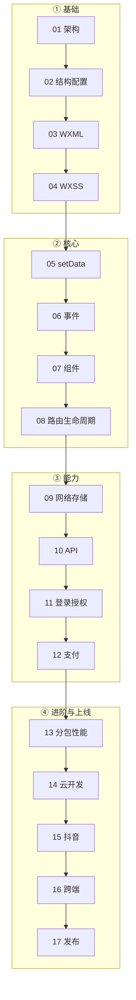

# 小程序开发学习合集 🟢（微信 + 抖音 + 跨端）

> 系统学小程序开发：**微信小程序（主线）+ 抖音/字节小程序 + 跨端框架(uni-app/Taro)**。面向有 Web 基础者，概念讲清 + 代码可跑。
> 权威对标：**[微信官方文档](https://developers.weixin.qq.com/miniprogram/dev/framework/)** + 抖音开放平台 + uni-app/Taro 官方。规范见 [`_CONVENTIONS.md`](./_CONVENTIONS.md)。

---

## 零、小程序开发和 Web 开发有什么不一样？（有 Web 基础必读）

| Web（H5/Vue） | 小程序 |
|---|---|
| 浏览器**单线程**渲染 | **双线程**：逻辑层(JS)+ 渲染层(视图)分离，通过 Native 通信 |
| HTML / CSS / JS | **WXML / WXSS / JS**（换了标签和样式方言） |
| DOM 直接操作 / Vue 响应式自动更新 | **`setData` 手动更新**数据到视图（不能直接操作 DOM） |
| px / rem | **rpx**（响应式单位，自动适配屏宽） |
| 路由自己配 | 内置**页面栈**路由（navigateTo/switchTab…） |
| 随便调浏览器 API | 只能用 **`wx.*` 受限 API** + 需授权 |
| 部署到服务器 | **提审上架**到微信/抖音平台 |

> 一句话：**小程序 ≈ "受限的、双线程的、要审核上架的 Vue"**。有 Vue/H5 基础学起来很快，重点适应双线程 + setData + 平台能力。

---

## 一、知识点索引（推荐按编号顺序）

图例：✅ 已写 · ⬜ 待生成

| # | 知识点 | 一句话 | 状态 |
|---|---|---|:--:|
| 01 | [小程序全景与架构](01-overview-architecture.md) | 是什么、双线程架构、和 H5 区别、开发者工具 | ⬜ |
| 02 | [项目结构与配置](02-project-config.md) | app 三文件 / 页面四文件 / app.json 全局配置 | ⬜ |
| 03 | [WXML 模板语法](03-wxml.md) | 数据绑定、wx:for、wx:if、事件绑定、template | ⬜ |
| 04 | [WXSS 样式](04-wxss.md) | rpx 响应式单位、样式导入、和 CSS 区别 | ⬜ |
| 05 | [逻辑层与 setData](05-logic-setdata.md) | Page/data/setData 原理与性能、生命周期 | ⬜ |
| 06 | [事件系统](06-events.md) | bind/catch、事件对象、冒泡、dataset 传参 | ⬜ |
| 07 | [自定义组件](07-component.md) | Component、properties、slot、组件通信、behaviors | ⬜ |
| 08 | [页面路由与生命周期](08-routing-lifecycle.md) | navigateTo/switchTab、页面栈、生命周期全景 | ⬜ |
| 09 | [网络请求与本地存储](09-network-storage.md) | wx.request 封装、storage、登录态维持 | ⬜ |
| 10 | [常用 API 与能力](10-apis.md) | 用户信息/定位/扫码/分享/媒体/剪贴板 | ⬜ |
| 11 | [登录与授权](11-login-auth.md) | wx.login→code→后端换 openid、getUserProfile、手机号 | ⬜ |
| 12 | [微信支付](12-payment.md) | 支付下单流程、前后端时序、安全 | ⬜ |
| 13 | [分包与性能优化](13-subpackage-performance.md) | 主包/分包、预下载、setData 优化、首屏、体验评分 | ⬜ |
| 14 | [云开发](14-cloud.md) | 云函数/云数据库/云存储，免后端快速开发 | ⬜ |
| 15 | [抖音/字节小程序](15-douyin.md) | 和微信的异同、tt API、多平台注意 | ⬜ |
| 16 | [跨端 uni-app / Taro](16-cross-platform.md) | 一套代码多端、原理、和原生取舍 | ⬜ |
| 17 | [发布与上架](17-publish.md) | 版本管理、体验版、审核、常见拒审 | ⬜ |

---

## 二、学习路线

> 有 Vue/H5 基础：01→08 快速过（重点 05 setData + 07 组件 + 双线程架构），09→12 是接后端的实战核心，13→17 按需。

## 三、进度

**共 17 篇** · 已完成 **1** · 待生成 **16**（告诉我编号或"继续"）。

> 每篇：一句话核心 → 核心概念 → 代码示例 → 要点速记 → 易错/最佳实践。微信原生为主线，抖音/跨端各一篇。
